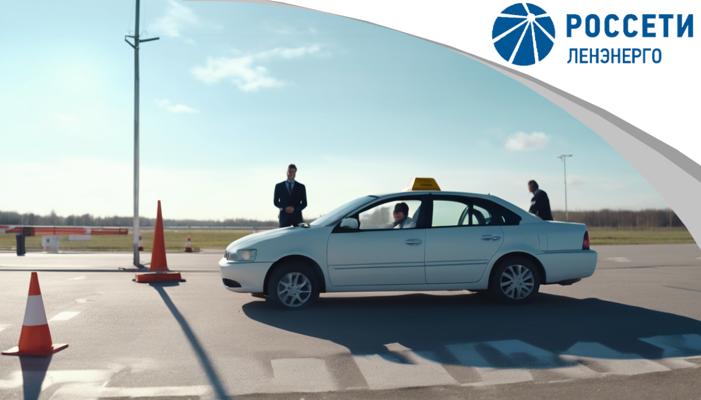

## 
Программа для проверки знаний правил дорожного движения «Автокласс»

### 
филиал ПАО "Россети Ленэнерго" "ЮЭС"

Программа «Автокласс» была создана для тестирования персонала и 
автоматизации отчета тестирования.

ПО "Автокласс" содержит инструмент, позволяющий актуализировать билеты,
до версии ПДД вступивший в силу на текущий момент времени.

ПО имеет понятный графический интерфейс и удобный формат вывода отчета.

#### <a href="https://github.com/MagicKubik/Autoclass/releases">Скачать актуальную версию</a>